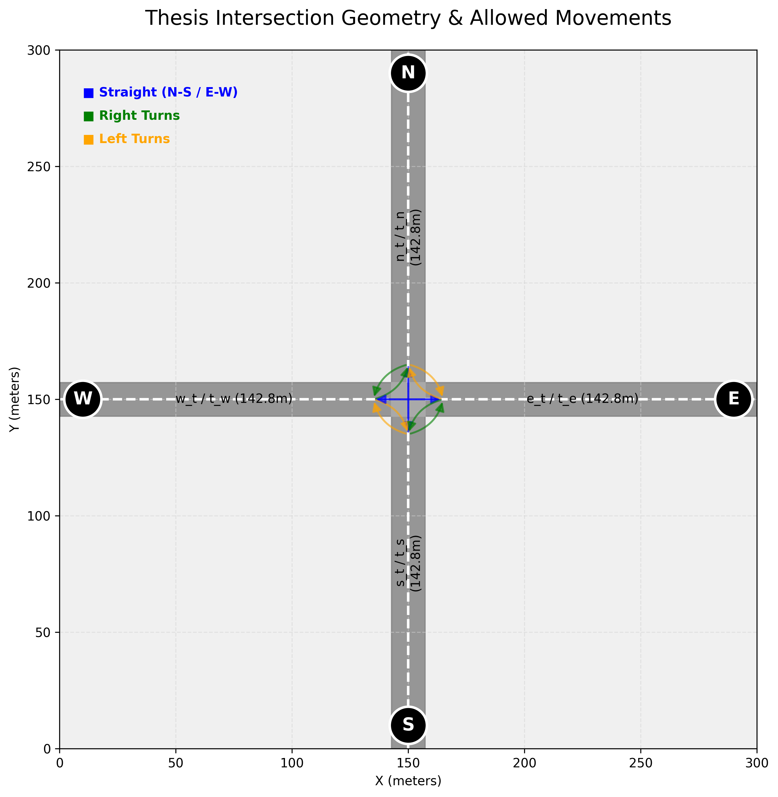
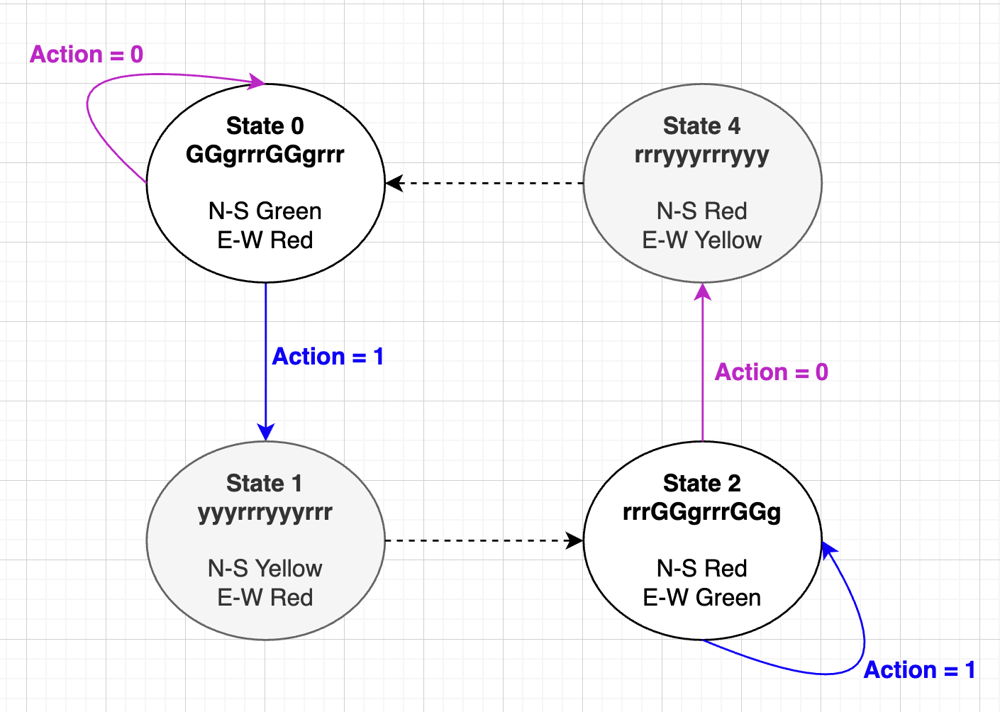

# 🚦 Adaptive Traffic Signal Control using Deep Reinforcement Learning

## 🎯 Project Overview

Traditional traffic lights run on fixed timers, leading to inefficient traffic flow, unnecessary waiting, and increased carbon emissions. This project aims to solve this by building and training Artificial Intelligence agents to act as dynamic traffic controllers.

Using Deep Reinforcement Learning (RL), the AI observes real-time traffic conditions and adapts signal phases on the fly to minimize vehicle waiting times and clear traffic jams before they gridlock.

---

## 🌍 The Simulation Environment

We use **SUMO (Simulation of Urban MObility)** as our physics and traffic engine. SUMO provides a highly realistic, micro-simulation environment where every vehicle follows car-following and lane-changing models.

### Intersection Setup

* **Geometry:** A symmetric, 4-way intersection (Right-Hand Traffic). Each of the 4 approaching arms (North, South, East, West) is approximately 142.8 meters long.
* **Movements:** 12 total allowed routes (Straight, Right, Left for all approaches). U-turns are strictly prohibited.

### The Reinforcement Learning Formulation (MDP)

To train the AI, the environment is framed as a Markov Decision Process:

* **State (The AI's "Eyes"):** Real-time data arrays containing the **vehicle density** (number of cars) and **accumulated waiting time** on each incoming lane.
* **Action (The AI's "Decision"):** The agent chooses between two primary phases:
* `Phase 0`: North-South Green (Straight/Right/Left allowed).
* `Phase 1`: East-West Green (Straight/Right/Left allowed).
* *Safety Constraint:* The environment automatically enforces a mandatory 5-second Yellow light transition to prevent collisions.

* **Reward (The AI's "Motivation"):** A negative penalty based on the total accumulated waiting time of all vehicles. The agent's objective is to maximize its reward by pushing the waiting time as close to zero as possible.

#### Intersection setup

#### States setup

---

## 🧠 The AI Models

This project compares two fundamentally different Reinforcement Learning architectures to evaluate which handles traffic management best.

| Algorithm | Type | Learning Mechanism |
| --- | --- | --- |
| **DQN (Deep Q-Network)** | Off-Policy | Utilizes a **Memory Replay Buffer**. It randomly explores, saves past experiences (traffic states and the resulting rewards) to a database, and samples batches from this history to update its strategy. |
| **A2C (Advantage Actor-Critic)** | On-Policy | Learns fluidly in the present moment without a memory buffer. It splits its network into an **Actor** (chooses the traffic phase) and a **Critic** (immediately evaluates the Actor's choice against the expected outcome). |

---

## 🚦 Experimental Scenarios

An effective traffic controller must handle both standard flow and sudden rush-hour spikes. We test the agents against two distinct traffic patterns:

1. **The Baseline: Stationary Flow**
* Constant, equal traffic generation (**500 vehicles/hour**) from all four directions.
* *Objective:* Evaluate if the agent can discover a stable, rhythmic, and fair cycle.

2. **The Challenge: Adaptive Flow**
* The simulation begins with standard traffic, but experiences a massive surge on the East-West axis between **1000 and 2000 seconds**.
* *Objective:* Evaluate the agent's agility. It must recognize the failing standard cycle, hold the East-West light green to absorb the shockwave, and gracefully return to normal operation without starving North-South traffic.

---

## 📊 Output & Evaluation Metrics

The repository automatically generates a telemetry dashboard to prove the agents are converging (learning).

* **The Learning Curve:** Plots the Average Waiting Time per episode over 50 total episodes. A downward slope indicates successful learning.
* **First 10 Episodes ("Exploration"):** High-resolution graphs of the initial training hours, showing expected traffic jams as the agent randomly guesses actions to map the environment.
* **Last 10 Episodes ("Exploitation"):** High-resolution graphs of the final trained agent perfectly handling the 1000s–2000s adaptive traffic spike.

---

## 📈 Expected Results & Hypothesis

* **Initial Learning:** **DQN** is expected to learn the baseline mechanics faster due to its ability to repetitively sample from its memory replay buffer.
* **Adaptability:** **A2C** is hypothesized to perform better during the Adaptive Flow surge. Because it updates on-policy in the present moment, it should be more reactive to the sudden 1000-second traffic spike than the DQN, which relies heavily on past (and potentially outdated) memories.

---